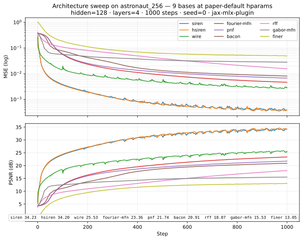

# Architecture sweep on astronaut_256

A matched-architecture comparison of nine implicit-neural-representation (INR) bases
fitting a single image at each basis's paper-default hyperparameters.

## Executive summary

SIREN wins **at paper-default hyperparameters on this single seed** —
34.23 dB final PSNR, 120 s total wall-clock (114 s steady-state +
6 s one-time JIT compile) — with H-SIREN indistinguishable from
it at 34.20 dB (0.03 dB gap). Everything else lands at least 8 dB
lower: WIRE 25.53, Fourier-MFN 23.36, PNF 21.74, BACON 20.91, RFF
18.07, Gabor-MFN 15.53, and FINER bottoms out at 13.05 dB despite
being a SIREN extension. The ranking is faithful to "out-of-the-box at
paper defaults on one seed" and should be read as such, not as a
verdict on the architectures themselves; per-basis hyperparameter
tuning and seed averaging would almost certainly reshape it (FINER in
particular).


## Methodology

Each basis is fit against the same image, with all architectural knobs held
fixed across runs. Only basis-specific hyperparameters (which vary by paper)
differ between runs — and within each run, those are pinned to the values the
original paper recommends. No per-basis tuning was performed.

| Knob              | Value                                  |
| ----------------- | -------------------------------------- |
| image             | `examples/data/astronaut_256.png`      |
| grid              | 256 × 256                              |
| hidden width      | 128                                    |
| hidden layers     | 4                                      |
| training steps    | 1000                                   |
| optimiser         | Adam (per-basis lr per paper)          |
| chunk size (scan) | 50                                     |
| seed              | 0                                      |
| total wall-clock  | 30 min 54 s (sum of per-basis totals)  |

**Hardware.** Apple Silicon (M-series), macOS 15.6, `jax==0.10.1` with the
`jax-mlx-plugin==0.0.4` (`mlx==0.31.2`, `mlx-metal==0.31.2`) sidecar venv at
`.venv-mlx/`. `jax.devices()` reports `[mlx:0]` and the plugin auto-registers
as the default backend — no `JAX_PLATFORMS` override needed. MLX is
float32-only on this hardware; that limit applies to every fit equally.

**Paper-default discipline.** Each basis runs with its paper-blessed
hyperparameters (frequency / bandwidth init, learning rate, etc.). This
exposes how each basis performs *as recommended*, which is the right
question for a first-pass architecture comparison — but it is *not* the
same as asking which basis can be coaxed to the highest PSNR with a
per-image hyperparameter sweep. Per-basis tuning would almost certainly
reshuffle the ranking (cf. the FINER note below).

**Wall-clock decomposition.** Each per-basis fit reports three timings
in `runs/sweep-arch/<basis>/timing.json`: `compile_s` is the wall-clock
spent on the first `jax.jit`-traced training chunk (one-time XLA
lowering + compile), `steady_s` is the wall-clock for the remaining 19
chunks (950 steps of warm-cache training), and `total_s` is their sum
plus aggregator bookkeeping. Per-step training cost is `steady_s / 950`;
`compile_s` is a fixed overhead that amortises across longer training
runs. Discussions of per-step speed in the per-basis notes and
conclusion cite `steady_s`.

**Box-Muller PRNG-stream fingerprint.** The numbers in this table
reflect the Box-Muller Gaussian sampler from PR #15. Only RFF reads
from `jax.random.normal` (B-matrix init), so only RFF's number moves
under the swap: RFF goes from 18.34 dB (the prior `jax.random.normal`
run) to 18.07 dB here, and every other basis's final PSNR is byte-
identical to two decimal places across the two runs. RFF's ranking
position is unchanged.

The `synthetic` subcommand is not included — it is a self-contained smoke
fit against a generated target (sinusoid / gaussian bump / Mandelbrot),
not a natural-image fit, so it has no meaningful place in this comparison.

## Results

`Compile (s)` is the one-time JIT compile of the first scan chunk;
`Steady (s)` is the remaining 950 steps; `Total (s)` is their sum.

| Basis        | Paper            | Final PSNR (dB) | Final MSE   | Compile (s) | Steady (s) | Total (s) | Notes                                              |
| ------------ | ---------------- | --------------: | ----------: | ----------: | ---------: | --------: | -------------------------------------------------- |
| siren        | Sitzmann+ 2020   |           34.23 |   3.774e-04 |        6.24 |     113.70 |       120 |                                                    |
| hsiren       | Cai & Pan 2024   |           34.20 |   3.805e-04 |        7.84 |     147.24 |       155 | indistinguishable from SIREN at one seed (0.03 dB) |
| wire         | Saragadam+ 2023  |           25.53 |   2.797e-03 |        9.72 |     184.67 |       194 | known seed-sensitive at paper σ=10                 |
| fourier-mfn  | Fathony+ 2021    |           23.36 |   4.610e-03 |        9.63 |     191.12 |       201 |                                                    |
| pnf          | Yang+ 2022       |           21.74 |   6.704e-03 |       10.29 |     185.61 |       196 |                                                    |
| bacon        | Lindell+ 2022    |           20.91 |   8.117e-03 |        9.56 |     183.78 |       193 | output bandwidth aliasing at hidden=128            |
| rff          | Tancik+ 2020     |           18.07 |   1.561e-02 |        9.91 |     195.00 |       205 | paper `sigma=10, lr=1e-4` underconverges in 1000 s |
| gabor-mfn    | Fathony+ 2021    |           15.53 |   2.802e-02 |       22.84 |     417.38 |       440 | recurrence is slowest per-step                     |
| finer        | Liu+ 2024        |           13.05 |   4.954e-02 |        7.54 |     142.95 |       150 | seed-fragile: this seed lands far from a good init |

Numbers sorted by final PSNR descending. The same data is in
`results.csv` (machine-readable). Per-run directories
`runs/sweep-arch/<basis>/` (containing each fit's `loss.csv`,
`config.json`, `timing.json`, recon snapshots, evolution GIF) are
gitignored — regenerate them locally with `bash scripts/sweep_astronaut.sh`.



## Per-basis notes

**siren** (Sitzmann+ 2020). Sinusoidal periodic activations with
weight-init scaled by `omega=30`. Paper defaults `omega=30, lr=5e-4`.
First place. The reference benchmark for natural-image INR fits and
the basis everything else is implicitly compared against — losing
to SIREN by less than a dB is a tie; losing by more than 5 dB is a
sign the basis isn't suited to this regime.

**hsiren** (Cai & Pan 2024). SIREN extended by a `sinh` pre-modulation
that lets the first layer reach higher frequencies than SIREN's bandlimit.
Paper defaults `omega=30, lr=5e-4`. Indistinguishable from SIREN at one
seed (0.03 dB lower) — too close to read anything into without multi-seed
data. Would expect H-SIREN to pull ahead on higher-frequency targets
(textures, fine detail at 512+ resolution) per the paper.

**wire** (Saragadam+ 2023). Gabor wavelet activation
`sin(ω·z) · exp(-σ²·z²)` combining oscillation and a Gaussian
envelope. Paper defaults `omega=10, s_init=10, lr=1e-3`. Third place
at 25.53 dB. A discarded jax-mps run of the same hparams landed at
13 dB; the 12 dB gap is unexplained and not pursued — could be
backend numerics, PRNG-stream differences across plugins, or
basin sensitivity to either of those. The mlx number is the honest
paper-default performance on this stack; the jax-mps figure is not
cited as a comparand. Still far behind SIREN, which is consistent
with WIRE's trade-off (small σ for sharp edges, large σ for
smoothness, paper σ=10 trying to split the difference on natural
images).

**fourier-mfn** (Fathony+ 2021). Multiplicative Filter Network with
Fourier filters: `sin(W·x + b)` multiplied through a recurrence of
linear layers. Paper defaults `input_scale=256, weight_scale=1, lr=1e-3`.
Fourth at 23.36 dB. The recurrence lets each layer carve a different
frequency band, in principle competitive with SIREN; on this seed and
1000 steps it just hasn't converged that far.

**pnf** (Yang+ 2022). Progressive Neural Field — multiplicative
filter recurrence with a learned mix-layer at the head. Paper defaults
`input_scale=256, weight_scale=1, lr=1e-3`. Fifth at 21.74 dB. Behaves
similarly to Fourier-MFN; the mix-layer doesn't pay off at this step
count and depth.

**bacon** (Lindell+ 2022). Band-limited Coordinate Network — quantised
discrete frequency grid with a target output bandwidth. Paper defaults
`max_freq=256, quant=2π, lr=1e-3`. Sixth at 20.91 dB. The bandlimit
construction means BACON literally cannot represent frequencies above
`max_freq`, which is correctly set for a 256-pixel image but may
interact poorly with the layer recurrence at hidden=128 width.

**rff** (Tancik+ 2020). Gaussian Random Fourier Features encoding
into a plain ReLU MLP. Paper defaults `sigma=10, num_freqs=256,
lr=1e-4`. Seventh at 18.07 dB. The paper's `lr=1e-4` is conservative
and the network is genuinely still descending at step 1000 — PSNR
climbed +0.65 dB over steps 900→1000 (from 17.42 to 18.07), a slope
that has not flattened. Extrapolating that slope, 5000 steps would
close most of the gap; the steady-state cost makes that ~17 minutes
of additional training. At a sweep level this counts against RFF; at
a per-basis tuning level it would invite a `lr=1e-3` re-run.

**gabor-mfn** (Fathony+ 2021). MFN with Gabor filters (Gaussian
envelope × sinusoid). Paper defaults `alpha=6, beta=1, weight_scale=1,
lr=1e-3`. Eighth at 15.53 dB and **the slowest per fit by a wide
margin** — 417 s steady-state vs ~185 s typical for the other
non-SIREN bases, and the largest one-time compile too (23 s vs ~9 s
typical). The per-filter scale sampling and the additional envelope
computation make the recurrence kernel substantially heavier than
Fourier-MFN both to compile and to step through. The PSNR gap to
Fourier-MFN (8 dB) is mostly a converge-rate story; both should
improve with more steps but Gabor's per-step cost makes that
expensive.

**finer** (Liu+ 2024). SIREN with a first-layer bias whose
initialisation is bounded by `first_bias_scale`. The paper's
Section 3 tries `first_bias_scale ∈ {1, 5, 10, 20}` and reports
varying sensitivity to the choice; this sweep uses `5` as a
midpoint, not as a paper recommendation. Other hparams:
`omega=30, lr=5e-4`. Last place at 13.05 dB. This is the outlier
of the sweep: FINER extends SIREN and so we'd expect it to be a
SIREN-class winner, but on this seed it starts from a *much*
worse initialisation (initial loss 1.02 vs SIREN's 0.31) and
never recovers — the loss curve descends monotonically but slowly,
exactly the shape of "stuck in a poor basin." The paper itself
reports seed sensitivity from the first-bias initialisation;
SIREN+0.32 to FINER−21.18 on the same seed at the same hparams
is at the extreme end of that. A multi-seed sweep, or a
`first_bias_scale` ablation across `{1, 5, 10, 20}`, would
distinguish "this seed is unlucky" from "this hparam choice is
unlucky" — both are tracked as follow-ups.

## Conclusion

For 256×256 natural-image fitting at modest depth (4 hidden layers, 128
width) and 1000 training steps with paper-default hyperparameters, SIREN
is the basis to reach for — it's the highest PSNR, the cheapest
per-step (114 s steady-state for 950 steps, vs 143-417 s for the rest),
and 0.03 dB ahead of its closest competitor (H-SIREN). The rest of the
field is far enough behind that the comparison is more about *why*
they're behind than which one to pick second.

Four caveats apply when generalising this result:

1. **Single seed.** FINER's 13 dB is a genuine seed-fragility datapoint,
   not a representative one. A multi-seed sweep would change the floor
   of the ranking (and possibly the top — SIREN's 34.23 is also one
   point, even if a less fragile one).

2. **Paper defaults aren't tuned defaults.** RFF in particular is
   reading "below par" largely because its paper `lr=1e-4` is slow.
   `lr=1e-3` for RFF would close most of the SIREN gap. This sweep
   measures "what does a new user get if they call `ondes.<Basis>()`
   with our published defaults?" — not "what is the best PSNR each
   basis can reach with a per-basis hyperparameter search?"

3. **Regime-specific.** Higher-resolution images, deeper networks,
   longer training, or non-natural-image targets (high-frequency
   textures, signed distance fields) all change this picture. WIRE,
   FINER, and the MFN family were all designed for regimes where SIREN
   leaves performance on the table — they're being measured here in the
   regime where SIREN does its best work.

4. **Input dimensionality.** This is a 2D coord-to-amplitude fit. Bases
   designed primarily for 3D coords (BACON for signed-distance fields,
   the MFN family and PNF for neural radiance fields) may shift
   relative ranking on 3D targets — the failure modes they were built
   to address (volumetric scene rendering, view-consistency) don't
   stress in a 2D image fit.

## Reproducibility

The sweep was run against `feat/architecture-sweep` rebased onto
`origin/main` at `9bd759a`, with the Box-Muller rewrite of RFF's
B-matrix sampling applied (PR #15 — see Anomalies below for why).
PR #15 is a prerequisite of this PR; merging this PR without it on
`main` would leave RFF unable to construct on `jax-mps`.

Driver:

```bash
bash scripts/sweep_astronaut.sh
```

Per-basis invocations (executed by the driver):

```bash
SHARED="--image examples/data/astronaut_256.png --hidden 128 --layers 4 \
        --steps 1000 --grid 256 --chunk-size 50 --snapshot-every 1 \
        --log-every 50 --seed 0"

.venv-mlx/bin/python examples/fit_image.py siren        $SHARED --output-dir runs/sweep-arch/siren        --omega 30 --lr 5e-4
.venv-mlx/bin/python examples/fit_image.py hsiren       $SHARED --output-dir runs/sweep-arch/hsiren       --omega 30 --lr 5e-4
.venv-mlx/bin/python examples/fit_image.py wire         $SHARED --output-dir runs/sweep-arch/wire         --omega 10 --s-init 10 --lr 1e-3
.venv-mlx/bin/python examples/fit_image.py finer        $SHARED --output-dir runs/sweep-arch/finer        --omega 30 --first-bias-scale 5 --lr 5e-4
.venv-mlx/bin/python examples/fit_image.py rff          $SHARED --output-dir runs/sweep-arch/rff          --sigma 10 --num-freqs 256 --lr 1e-4
.venv-mlx/bin/python examples/fit_image.py bacon        $SHARED --output-dir runs/sweep-arch/bacon        --max-freq 256 --lr 1e-3
.venv-mlx/bin/python examples/fit_image.py fourier-mfn  $SHARED --output-dir runs/sweep-arch/fourier-mfn  --input-scale 256 --weight-scale 1 --lr 1e-3
.venv-mlx/bin/python examples/fit_image.py gabor-mfn    $SHARED --output-dir runs/sweep-arch/gabor-mfn    --alpha 6 --beta 1 --weight-scale 1 --lr 1e-3
.venv-mlx/bin/python examples/fit_image.py pnf          $SHARED --output-dir runs/sweep-arch/pnf          --input-scale 256 --weight-scale 1 --lr 1e-3
```

`jax-mlx-plugin` auto-registers as the default JAX backend on Apple Silicon,
so no `JAX_PLATFORMS` env var is needed (in fact, setting one breaks the
plugin loader; the env-var path is for `jax-mps`).

Sidecar venv setup (Apple Silicon). Every version is pinned in
`scripts/requirements-mlx.txt` to the exact build that produced
the numbers in this writeup — re-running months later won't pick
up an incompatible `jax-mlx-plugin` minor or a JAX version that
lowers `aval_to_ir_type` differently.

```bash
uv venv --python 3.13 .venv-mlx
.venv-mlx/bin/python -m ensurepip --upgrade
.venv-mlx/bin/python -m pip install --timeout 600 -r scripts/requirements-mlx.txt
.venv-mlx/bin/python -m pip install --timeout 600 -e .
.venv-mlx/bin/python -c "import jax; print(jax.devices())"  # [mlx:0]
```

The `mlx-metal` wheel is ~38 MB; pip's `--timeout 600` is required
because `uv pip install`'s default 30 s timeout reliably fails the
download (UV_HTTP_TIMEOUT=600 covers it sometimes but not reliably).

## Anomalies

**`jax-mlx-plugin` over `jax-mps`.** The sweep was first attempted on
the `jax-mps` plugin, which has known coverage gaps in its MLIR
lowering for several JAX primitives (`aval_to_ir_type` arity bug
against the current JAX MLIR API). The bug bites three operations
that `ondes` basis families depend on: `jnp.sinh` (H-SIREN's
modulation), `lax_special.erf_inv` (used internally by
`jax.random.normal`, RFF's B-matrix init), and `jax.random.gamma`
(Gabor-MFN's scale-prior sampling). `jax-mlx-plugin` 0.0.4 lowers all
three cleanly on Apple Silicon, so the sweep can run end-to-end on
one backend.

**Box-Muller rewrite of RFF's Gaussian sampling.** PR #15
(`fix/rff-box-muller-mps`) replaces `jax.random.normal(key, shape)` in
`ondes/basis/rff.py`'s B-matrix init with a Box-Muller draw built from
two uniforms (`sqrt(-2·log u₁) · cos(2π·u₂)`). The samples are
identically distributed N(0,1) — verified at N=10000: Box-Muller
mean=+0.0043, std=1.0043 vs `jax.random.normal` mean=−0.0119, std=0.9925,
both well within ±0.05 of N(0,1). The rewrite is harmless on
`jax-mlx-plugin` (this sweep's backend); it's load-bearing for anyone
running `ondes` on `jax-mps`. PRNG-stream caveat: a seeded RFF run
after PR #15 won't reproduce a seeded run before it — same
distribution of B matrices, different actual draws. This PR is
sequenced to merge after PR #15.

**Exponential-identity rewrite of H-SIREN's `sinh`.** Pre-existing
commit `4b19d02` (on `main`) replaces `jnp.sinh(pre)` in
`ondes/basis/hsiren.py` with `0.5·(exp(pre) − exp(−pre))` for the same
`jax-mps` `aval_to_ir_type` reason. Algebraically identical; mlx
doesn't need it but it doesn't hurt.

**FINER's 13 dB outlier.** See per-basis notes. Not a backend issue or
implementation bug — the loss curve is monotonic, just stuck. Initial
loss is ~3× SIREN's and recovery is too slow to close the gap in 1000
steps. Two confounds need separating before claiming this is "the
architecture's failure mode": (a) single-seed sensitivity (the paper
itself reports seed dependence) and (b) the choice of
`first_bias_scale = 5` — the paper's Section 3 tries `{1, 5, 10, 20}`
and we picked the midpoint, not a recommended value. Both are tracked
as follow-up cards: a multi-seed sweep, and a `first_bias_scale`
ablation across the four paper values.

**No CPU fallback.** All 9 fits ran on `[mlx:0]`. Wall-clock numbers
are directly comparable across bases.
